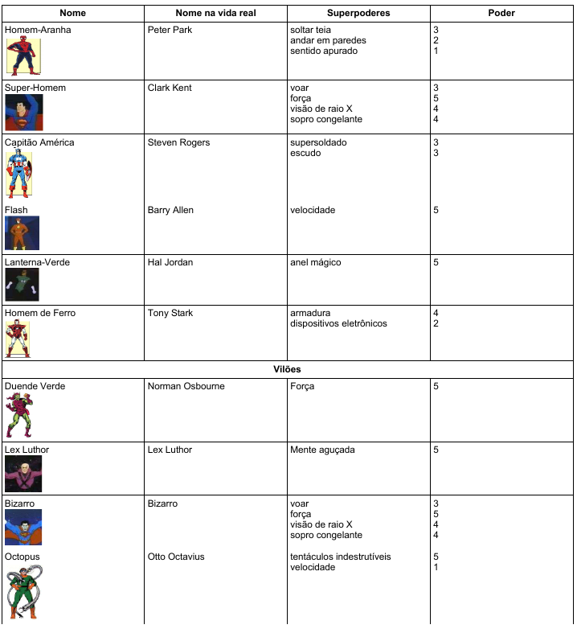

# Aula 08 (15/04) - Atividade de Busca Ativa

Nesta Terça-feira, dia 15/04, estarei fora de SP e não poderei estar ministrando a aula. Estou deixando uma ativade de busca ativa com objetivo de todos estudarem para próxima aula.

## Super-Heróis

Os super-heróis são personagens fictícios dotados de poderes sobre-humanos. Criados pela imaginação do homem, eles estão sempre em alerta para proteger o mundo dos ataques de mentes cruéis que pretendem dominar o nosso planeta. Cada super-herói tem uma origem interessante. Alguns, como o Incrível Hulk, o Capitão América e o Homem de Ferro, surgiram em laboratórios, e eram pessoas comuns antes de adquirirem seus superpoderes a partir de acidentes ou experiências com raios-gama, reações químicas e estudos científicos nos campos da física, engenharia e biologia. Outros, como o Super-Homem e o Lanterna-Verde, vieram de outros planetas. Existem ainda aqueles que se originaram da mitologia grega, romana ou nórdica, como é o caso do Thor e a Mulher-Maravilha. Os primeiros super-heróis apareceram entre 1930 e 1960, e o desenho em quadrinhos foi o principal veículo de divulgação em massa, antes da chegada da televisão. As principais empresas do ramo são a Hanna-Barbera, produtora da afamada Liga da Justiça (Super-amigos, 1973) e a Marvel, criadora de dezenas de personagens "vivos" até hoje.
Em quase todas as histórias inventadas, o super-herói é chamado para resolver um problema ou enfrentar ameaças de um vilão com um plano maligno. O vilão também é munido de superpoderes mas dificilmente consegue vencer o super-herói, pois os poderes deste são mais fortes.
Na lista abaixo são citados alguns super-heróis e alguns vilões, dos quais indubitavelmente já ouvimos falar. A lista apresenta também o nome na vida real e os superpoderes de cada um. Os superpoderes foram categorizados de 1 a 5, sendo 5 o poder mais forte e 1 o poder mais fraco.

# Atividade de Estudo

- Tomando por base o contexto apresentado e utilizando os termos técnicos adequados, explique o que é o JSON e para que serve.

- Como exercício, crie um arquivo JSON com a definição de um objeto contendo os dados de todos os  super-heróis e vilões listados.